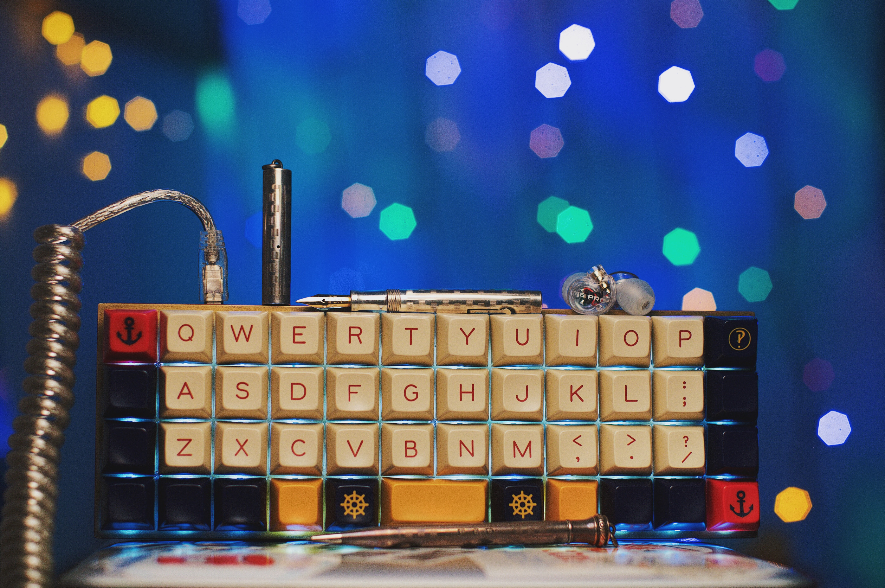

# The BrickKiln Layout for Planck Keyboard



A customized keymap that makes better use of thumbs and palms. Made for macOS.

## QWERTY Layer

```
* ,-----------------------------------------------------------------------------------.
* | Tab  |   Q  |   W  |   E  |   R  |   T  |   Y  |   U  |   I  |   O  |   P  | Bksp |
* |------+------+------+------+------+-------------+------+------+------+------+------|
* | Esc  |   A  |   S  |   D  |   F  |   G  |   H  |   J  |   K  |   L  |   ;  |  "   |
* |------+------+------+------+------+------|------+------+------+------+------+------|
* |Shift(|   Z  |   X  |   C  |   V  |   B  |   N  |   M  |   ,  |   .  |   /  |Shift)|
* |------+------+------+------+------+------+------+------+------+------+------+------|
* |  Nav | Ctrl | Alt  | GUI  | Bksp |    Space    | Enter| Spot |LSpace|RSpace|  Nav |
* `-----------------------------------------------------------------------------------'
```

This layer emulates the standard QWERTY layout with a few add-ons and exceptions:

- Backspace and Enter are moved next to Space. Tap these for Backspace and Enter, hold for Lower and Raise respectively. These two keys are used too often to be assigned to the weak right pinky. This arrangement also gives the thumbs a little more action beyond pressing Space. An extra Backspace is kept in the original position for the rare occasions you have to hold it to delete a whole sentence.
- The navigation keys are moved to a new layer so you don't have to move my hand away from the home row. More on this later. The new layer can be activated using either bottom corner key with the edge of one's palm. This is a lot more convenient and comfortable than it sounds.
- Backlight key is also moved to the navigation layer. I still don't understand why this key is on the main layer by default.
- Space Cadet Shift because it's amazing. Tap for parentheses, hold for Shift.
- Dedicated Spotlight key. I also throw in two keys to move around spaces in macOS since I do not know what to do with the extra space the navigation cluster leaves. Quite useful if you work in full screen mode on a regular basis though.

## Lower Layer - Symbols

```
* ,-----------------------------------------------------------------------------------.
* |   ~  |      |      |      |   [  |   +  |   -  |   ]  |   _  |      |      | Bksp |
* |------+------+------+------+------+-------------+------+------+------+------+------|
* | Del  |   !  |   @  |   #  |   $  |   %  |   ^  |   =  |   *  |   &  |      |  |   |
* |------+------+------+------+------+------|------+------+------+------+------+------|
* |      |      |      |      |   {  |   *  |   /  |   }  |      |      |   \  |      |
* |------+------+------+------+------+------+------+------+------+------+------+------|
* |      |      |      |      |      |             |      |      |      |      |      |
* `-----------------------------------------------------------------------------------'
```

Things get funky here. Symbols are shifted to the second row for easier access. Braces and operators are relocated to where the index fingers are for programming purposes. I have to make some compromises, such as the awkward position of `&`, but it's for the greater good.

## Raise Layer - Numbers

```
/* Raise
 * ,-----------------------------------------------------------------------------------.
 * |   `  |  F1  |  F2  |  F3  |  F4  |  F5  |  F6  |  F7  |  F8  |  F9  |  F10 | Bksp |
 * |------+------+------+------+------+-------------+------+------+------+------+------|
 * | Del  |   1  |   2  |   3  |   4  |   5  |   6  |   7  |   8  |   9  |   0  |      |
 * |------+------+------+------+------+------|------+------+------+------+------+------|
 * |      |  F11 |  F12 |  F13 |  F14 |  F15 |  F16 |  F17 |  F18 |  F19 |      |      |
 * |------+------+------+------+------+------+------+------+------+------+------+------|
 * |      |      |      |      |      |             |      |      |      |      |      |
 * `-----------------------------------------------------------------------------------'
 ```

 Similar principle as applied to the previous layer. Having numbers on the home row just makes so much sense!

## Navigation Layer

```
/* Navigation Layer
 * ,-----------------------------------------------------------------------------------.
 * |      |      |      |      |      | Prev | Next | LWord|  Up  | RWord| PgUp |Brite |
 * |------+------+------+------+------+-------------+------+------+------+------+------|
 * |      |      |      |      |      | Vol- | Vol+ | Left | Down | Right| PgDn |      |
 * |------+------+------+------+------+------|------+------+------+------+------+------|
 * |      |      |      |      |      | Mute | Play | Bksp |  Tab | Enter|      |      |
 * |------+------+------+------+------+------+------+------+------+------+------+------|
 * |      |      |      |      |      |             |      |      |      |      |      |
 * `-----------------------------------------------------------------------------------'
 ```

 With the edge of the palm on the layer keys, your fingers should be right where the navigation cluster is. Couple of added features here:
 - Extra Backspace, Tab, and Enter for one hand code editing.
 - Macros for Alt + Left/Right to move the cursor by word instead of by character.
 - Backlight and media control keys are moved to this layer just because.

## Programming instruction

- Clone and move the repo to the qmk keymaps folder.
- `cd` to the planck folder and run the following command
```
$ make KEYMAP=brickkiln dfu
```
